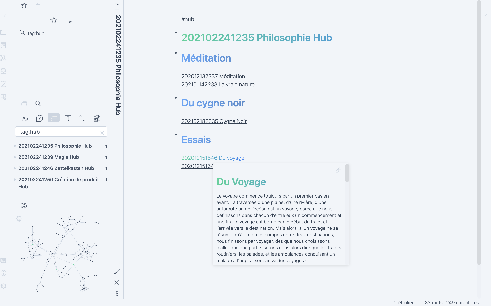

# Headwind

A simple yet beautiful minimal theme for Obsidian, using tailwindcss.

If you find any value with this theme, please add a star to it !



## Usage

```bash
npm install
npm run build:css
```

Will generate a `Headwind.css` file that can be copied in `.obsidian/themes` folder.

## Roadmap

- [ ] YAML styling
- [ ] Support for Dark theme

## Contributing

If you consider contributing, feel free to do so!

The files are stored in `components` folder.

You can use `npm run watch` to hot compile.

